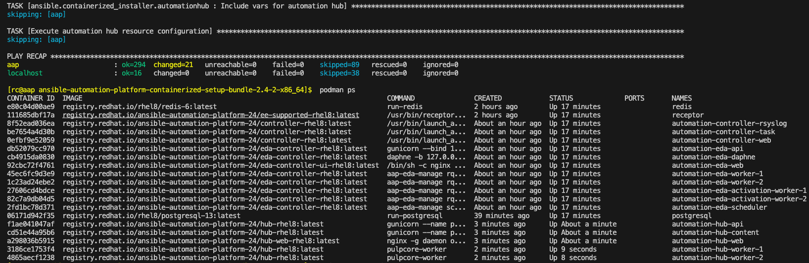

# Ansible Automation Platform containerized installation

This repo helps to install Containerised Ansible Automation Platform on to RHEL 9 node.  
It also installs
1. Automation Hub
2. Event Driven Ansible

# My Env
1. A Rhel 9.3 VM
   1. 4 CPU
   2. 16Gb Ram
   3. 40Gb disk
   4. Running on VMware Fusion Workstation
   5. ansible user = rc
   6. Its hostname is `node3` # As defined in the inventory file

# Pre Req
1. You can run ansible scripts on the node i.e. SSH is already setup
   1. `inventory` file is in this repo. [Make changes as per your env]
   2. `ansible.cfg` file is in this repo. [Make changes as per your env]
2. Download `Containerized Setup Bundle` ~ 2Gb from [here](https://access.redhat.com/downloads/content/480/ver=2.4/rhel---9/2.4/x86_64/product-software)
3. `var_yaml` file in this repo. Use the `var_yaml sample` file to create your own.
4. `aap_inventory` file in this repo. Use the `aap_inventory sample` one to create your own.
   1. I replaced `fqdn_of_your_rhel_host` with `aap`
   2. Uncomment database section because we will deploy DB on to the same node
   3. Add values in mandatory sections
   4. Make sure you have account on [redhat registry](https://developers.redhat.com/). You need to give username and password to pull containers from there
   5. I used `admin@123` as password for everything.
   6. Should look something like
``` yaml
[automationcontroller]
aap ansible_connection=local

[automationhub]
aap ansible_connection=local

[automationeda]
aap ansible_connection=local

[all:vars]

postgresql_admin_username=postgres
postgresql_admin_password=admin@123

# Give credentials here 
registry_username=<your RHN username>
registry_password=<your RHN password>

controller_admin_password=admin@123
controller_pg_host=aap
controller_pg_password=admin@123

hub_admin_password=admin@123
hub_pg_host=aap
hub_pg_password=admin@123

eda_admin_password=admin@123
eda_pg_host=aap
eda_pg_password=admin@123
```

# Run
```sh 
cd /Users/arslankhan/Codes/ansible-automation-platform-installation

# Pre flight script to check things
ansible-playbook -l node3 0*.yaml
# Install packages
ansible-playbook -l node3 1*.yaml
# Copy and extract setup bundle. 
ansible-playbook -l node3 2*.yaml
# Copy aap_inventory file
ansible-playbook -l node3 3*.yaml 
# Start installation
ansible-playbook -l node3 4*.yaml
# Uninstall
ansible-playbook -l node3 5*.yaml
```
### On remote host 
``` sh
# Install
ansible-playbook -i inventory ansible.containerized_installer.install
# Uninstall
ansible-playbook -i inventory ansible.containerized_installer.uninstall -e container_keep_images=true -e postgresql_keep_databases=true

# /home/rc/ansible-automation-platform-containerized-setup-bundle-2.4-2-x86_64/collections/ansible_collections/ansible/containerized_installer/playbooks
```
# Successful installation


### Urls
1. [cockpit](https://node3:9090/)  
2. [AAP](https://node3:8443)  
3. [AAP API ](https://node3:8443/api/)
4. [Automation Hub](https://node3:8444)
5. [EDA](https://node3:8445)  

#### Useful Links
- [Chapter 1. Ansible Automation Platform containerized installation ](https://access.redhat.com/documentation/en-us/red_hat_ansible_automation_platform/2.4/html/containerized_ansible_automation_platform_installation_guide/aap-containerized-installation#system_requirements)   

- [Install containerized Ansible Automation Platform on RHEL 9.2](https://developers.redhat.com/articles/2023/11/30/install-containerized-ansible-automation-platform-rhel-92#)